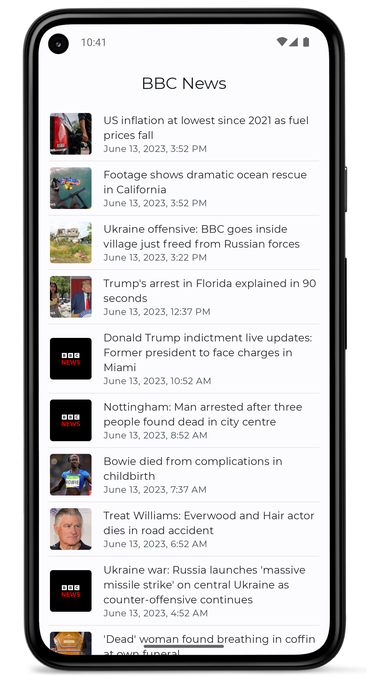

# News App
### Assumptions
- **Fetching First Page:** Since the assignment does not specify pagination, the assumption is made that the app will only fetch the first page of headlines from the News API. If pagination is required, additional implementation would be needed to fetch and display subsequent pages of headlines.
- **Biometric Authentication Failure Handling:** Biometric authentication has been implemented in the app for devices with fingerprint scanners. However, for demonstration purposes, the app allows access even if the biometric authentication fails.
- **Limited Unit Test Coverage:** The unit tests in the app primarily focus on the ViewModel, covering most of the business logic.

## Screenshots

### Portrait:

## Landscape:
 

